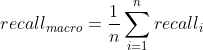

# ChpoBERT：面向中文政策文本的预训练模型

[论文链接](https://qbxb.istic.ac.cn/CN/abstract/abstract745.shtml)

## 介绍

随着深度学习的迅速发展和领域数据的快速积累，领域化的预训练模型在知识组织和挖掘中发挥了越来越重要的支撑作用。面向海量的中文政策文本，结合相应的预训练策略构建中文政策文本预训练模型，不仅有助于提升中文政策文本智能化处理的水平而且为政策文本数据驱动下的精细化和多维度分析与探究奠定了坚实的基础。面向国家级、省级和市级平台上的政策文本，通过自动抓取和人工辅助相结合的方式，在去除非政策文本的基础上确定了131,390份政策文本，总字数为305,648,206。面向所构建的中文政策文本语料库，基于BERT-base-chinese和Chinese-RoBERTa-wwm-ext，本文利用MLM和WWM任务构建了中文政策文本预训练模型（ChpoBERT），并在Github上对该模型进行了开源。在困惑度评价指标和政策文本自动分词、词性自动标注、命名实体识别下游任务上， ChpoBERT系列模型均表现出了较优的性能，可为政策文本的智能知识挖掘提供领域化的基础计算资源支撑。


## 使用方法

### Huggingface Transformers

基于Huggingface Transformers的from_pretrained方法可以直接在线获取ChpoBERT-mlm，ChpoBERT-wwm，ChpoRoBERTa-mlm和ChpoRoBERTa-wwm模型。

- ChpoBERT-mlm

```python
from transformers import AutoTokenizer, AutoModel

tokenizer = AutoTokenizer.from_pretrained("KM4STfulltext/ChpoBERT-mlm")

model = AutoModel.from_pretrained("KM4STfulltext/ChpoBERT-mlm")
```

- ChpoBERT-wwm

```python
from transformers import AutoTokenizer, AutoModel

tokenizer = AutoTokenizer.from_pretrained("KM4STfulltext/ChpoBERT-wwm")

model = AutoModel.from_pretrained("KM4STfulltext/ChpoBERT-wwm")
```

- ChpoRoBERTa-mlm

```python
from transformers import AutoTokenizer, AutoModel

tokenizer = AutoTokenizer.from_pretrained("KM4STfulltext/ChpoRoBERTa-mlm")

model = AutoModel.from_pretrained("KM4STfulltext/ChpoRoBERTa-mlm")
```

- ChpoRoBERTa-wwm

```python
from transformers import AutoTokenizer, AutoModel

tokenizer = AutoTokenizer.from_pretrained("KM4STfulltext/ChpoRoBERTa-wwm")

model = AutoModel.from_pretrained("KM4STfulltext/ChpoRoBERTa-wwm")
```


## 数据集


### 预训练数据集

中文政策文本预训练数据集涵盖了全国30个省市和经济发展水平前列的20个城市，也包括国家政策方针。实验涉及的训练集来自240个政策发布平台，共包含131390条数据，总字数305648206。

政策文本发布机构统计如下。

| 编号 | 政策发布机构 | 数据量 | 占比(%) | 编号 | 政策发布机构     | 数据量 | 占比(%) |
| ---- | ------------ | ------ | ------- | ---- | ---------------- | ------ | ------- |
| 1    | 国家级       | 4755   | 3.619   | 17   | 辽宁省           | 2391   | 1.820   |
| 2    | 安徽省       | 5824   | 4.433   | 18   | 内蒙古自治区     | 167    | 0.127   |
| 3    | 北京市       | 12709  | 9.673   | 19   | 宁夏回族自治区   | 4030   | 3.067   |
| 4    | 福建省       | 4762   | 3.624   | 20   | 青海省           | 46     | 0.035   |
| 5    | 广东省       | 12113  | 9.219   | 21   | 贵州省           | 443    | 0.337   |
| 6    | 上海市       | 9448   | 7.191   | 22   | 山西省           | 2393   | 1.821   |
| 7    | 湖南省       | 16926  | 12.882  | 23   | 陕西省           | 1352   | 1.029   |
| 8    | 海南省       | 3803   | 2.894   | 24   | 广西壮族自治区   | 1629   | 1.240   |
| 9    | 河北省       | 6027   | 4.587   | 25   | 四川省           | 3920   | 2.983   |
| 10   | 河南省       | 2981   | 2.269   | 26   | 天津市           | 722    | 0.550   |
| 11   | 江苏省       | 12361  | 9.408   | 27   | 西藏自治区       | 303    | 0.231   |
| 12   | 浙江省       | 9935   | 7.561   | 28   | 新疆维吾尔自治区 | 916    | 0.697   |
| 13   | 山东省       | 5059   | 3.850   | 29   | 云南省           | 1242   | 0.945   |
| 14   | 吉林省       | 398    | 0.303   | 30   | 湖北省           | 2120   | 1.614   |
| 15   | 黑龙江省     | 450    | 0.342   | 31   | 重庆市           | 1669   | 1.270   |
| 16   | 江西省       | 496    | 0.378   | 32   | ---              | ---    | ---     |

数据示例如下。

| 标题                               | 内容                                                         |
| ---------------------------------- | ------------------------------------------------------------ |
| 深圳市政府采购评标定标分离管理办法 | 第一章总则第一条为了建立适应高质量发展要求的现代政府采购制度，改进政府采购评审机制和交易机制，形成有效管用、简便易行、有利于实现优质优价采购结果的政府采购竞争机制,助力深圳加快建设中国特色社会主义先行示范区，根据《中华人民共和国政府采购法》《深圳经济特区政府采购条例》《深圳经济特区政府采购条例实施细则》等相关法律法规，结合我市实际情况，制定本办法。第二条评标定标分离（以下简称评定分离）是指在政府集中采购程序中，以公开招标方式执行采购，评审委员会负责对投标文件进行评审、推荐候选中标供应商并出具书面评审报告，由采购人根据评审委员会出具的评审报告从推荐的候选中标供应商中确定中标供应商…… |


### 验证数据集

自动分词验证语料数据集来源于南京农业大学新时代人民日报分词语料库（http://corpus.njau.edu.cn/ ），该语料库由黄水清等基于2015-2018年之间共9个月的《人民日报》数据构建而成，在多项测评上相较于北京大学计算语言研究所构建的1988年人民日报分词语料性能表现更为突出。基于该语料库，经过人工多次和反复的筛选，从中选取与政策相关的文本共374篇，总字数为78,311字。

自动词性标注验证数据集来源于北京大学人民日报经过词性标注的语料，该语料由北京大学计算语言学研究所俞士汶基于《人民日报》1998年的纯文本语料构建，是我国第一个大型的现代汉语词性标注语料库。基于词性标注语料库，在人工精筛选的基础上，获取到了445篇有关政策的语料文本，共计112,028字。

识别自动识别语料来源于本研究所爬取的政策全文本语料，本研究选取了982篇用以标注实体，其中682篇为科技政策文本（共计902,048字），300篇为其他领域的政策文本（共计1,016,346字）。在所制定的实体标注规范的基础上，基于“BIOES”标注集完成对所获取政策文本中实体的人工标注，从而构建中文政策预训练模型的验证数据集。数据集中所标注的实体共有四类，分别为政策性质、政策时间、适用区域和政策领域。

标注实体样例如下表所示。

| 验证任务 | 样例                                                         |
| -------- | ------------------------------------------------------------ |
| 自动分词 | 《/意见/》/要求/，/各/有关/地区/和/部门/要/充分/发挥/市场/在/资源/配置/中/的/决定性/作用/和/更/好/发挥/政府/作用/，/以/提高/供给/能力/为/目标/，/以/完善/政策/措施/为/基础/，/以/提高/科技/水平/为/支撑/，/建立/健全/木本/油料/种植/、/加工/、/流通/、/消费/产业/体系/，/ |
| 词性标注 | 这/r12/m项/q特殊/a优惠/vn政策/n的/u主要/b内容/n是/v，/w凡/d持有/v《/w昆明市/ns特困/b职工/n优惠证/n》/w的/u职工/n，/w工商/n部门/n应/v优先/v为/v其/r办理/v营业执照/n并/c提供/v摊位/n，/w同时/c免/v收/v市场管理费/n、/w个体/n工商/n管理费/n等/u费用/n |
| 实体识别 | 山/B-X3 东/M-X3 省/E-X3 人民政府令第283号《 山/B-X3 东/M-X3 省/E-X3 国有土地储备 办/B-X1 法/E-X1 》已经由省政府第44次常务会议修订通过，现将修订后的《 山/B-X3 东/M-X3 省/E-X3 国有土地储备 办/B-X1 法/E-X1 》公布。 |


## 模型评测公式

本研究的预训练模型验证将结合混淆矩阵，对于词汇的分词、词性的标注和实体的识别性能使用精确率*P*（Precision）、召回率*R*（Recall）、*F1*值（F1-score）指标进行评价。对于总体分词、标注和识别性能，使用宏平均（macro-avg）和加权平均（weighted-avg）中的*P、R、F1*指标进行评价，具体计算公式如下。

<center>
    
</center>


<center>
    
</center>


<center>
    
</center>


宏平均为所有类别的指标值的算数平均值，即宏精确率、宏召回率和宏*F1*值，具体计算公式如下。

<center>
    
</center>


<center>
    
</center>


<center>
    
</center>


加权平均将样本数量占样本总数比例作为计算平均值的权重，指标为加权精确率、加权召回率和加权F1值，具体计算公式如下。

<center>
    
</center>


<center>
    
</center>


<center>
    
</center>


## 模型下载

我们提供的是PyTorch版的模型。


### 下载途径

- 从Huggingface官网下载。

- [ChpoBERT-mlm](https://huggingface.co/KM4STfulltext/ChpoBERT-mlm)

- [ChpoBERT-wwm](https://huggingface.co/KM4STfulltext/ChpoBERT-wwm)

- [ChpoRoBERTa-mlm](https://huggingface.co/KM4STfulltext/ChpoRoBERTa-mlm)
- [ChpoRoBERTa-wwm](https://huggingface.co/KM4STfulltext/ChpoRoBERTa-wwm)


## 验证结果

我们使用四个中文政策预训练模型、两个基准模型和ERNIE模型在验证集上开展下游任务，对比预训练模型与基准模型的性能。实验结果如下所示。

#### 政策文本自动分词实验结果

| Model                   | Precision  | Recall     | F1-score   | Support |
| ----------------------- | ---------- | ---------- | ---------- | ------- |
| Bert-base-chinese       | 0.9691     | 0.9752     | 0.9721     | 3793    |
| ChpoBert-mlm            | 0.9696     | 0.9757     | 0.9727     | 3793    |
| ChpoBert-wwm            | **0.9727** | **0.9760** | **0.9743** | 3793    |
| Chinese-RoBerta-wwm-ext | 0.9634     | 0.9726     | 0.9680     | 3793    |
| ChpoRoberta-mlm         | 0.9693     | 0.9744     | 0.9719     | 3793    |
| ChpoRoberta-wwm         | 0.9685     | 0.9713     | 0.9699     | 3793    |
| ERNIE                   | 0.9625     | 0.9686     | 0.9656     | 3793    |

#### 政策文本词性标注实验结果

| Model                   | Weighted Avg Precision | Weighted Avg Recall | Weighted Avg F1-score | Support |
| ----------------------- | ---------------------- | ------------------- | --------------------- | ------- |
| Bert-base-chinese       | 0.8788                 | 0.9033              | 0.8896                | 5221    |
| ChpoBert-mlm            | **0.8902**             | 0.9119              | 0.8999                | 5221    |
| ChpoBert-wwm            | 0.8844                 | 0.9060              | 0.8941                | 5221    |
| Chinese-RoBERTa-wwm-ext | 0.8781                 | 0.9050              | 0.8903                | 5221    |
| ChpoRoBERTa-mlm         | 0.8898                 | **0.9144**          | **0.9012**            | 5221    |
| ChpoRoBERTa-wwm         | 0.8831                 | 0.9050              | 0.8930                | 5221    |
| ERNIE                   | 0.8405                 | 0.8835              | 0.8595                | 5221    |

#### 政策文本实体识别结果

| Model                   | Macro Avg  |            |            | Weighted Avg |            |            | Support |
| ----------------------- | ---------- | ---------- | ---------- | ------------ | ---------- | ---------- | ------- |
|                         | Precision  | Recall     | F1-score   | Precision    | Recall     | F1-score   |         |
| Bert-base-chinese       | 0.7590     | 0.8769     | 0.8040     | 0.7672       | 0.8971     | 0.8193     | 763     |
| ChpoBert-mlm            | 0.7478     | 0.8913     | 0.8088     | 0.7573       | 0.9037     | 0.8203     | 763     |
| ChpoBert-wwm            | **0.7741** | **0.9008** | **0.8243** | **0.7819**   | **0.9184** | **0.8379** | 763     |
| Chinese-RoBerta-wwm-ext | 0.7506     | 0.8770     | 0.8013     | 0.7630       | 0.8957     | 0.8170     | 763     |
| ChpoRoberta-mlm         | 0.7686     | 0.8936     | 0.8191     | 0.7805       | 0.9091     | 0.8336     | 763     |
| ChpoRoberta-wwm         | 0.7672     | 0.8966     | 0.8188     | 0.7732       | 0.9118     | 0.8303     | 763     |
| ERNIE                   | 0.6990     | 0.8808     | 0.7702     | 0.7162       | 0.8997     | 0.7894     | 763     |
